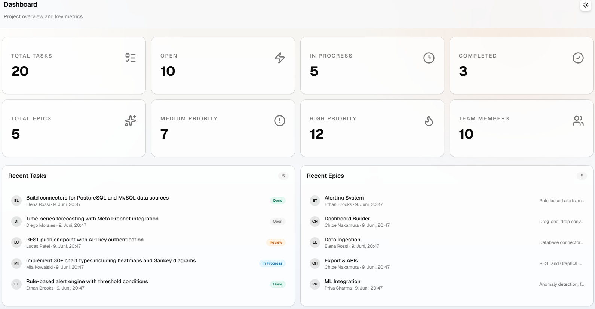
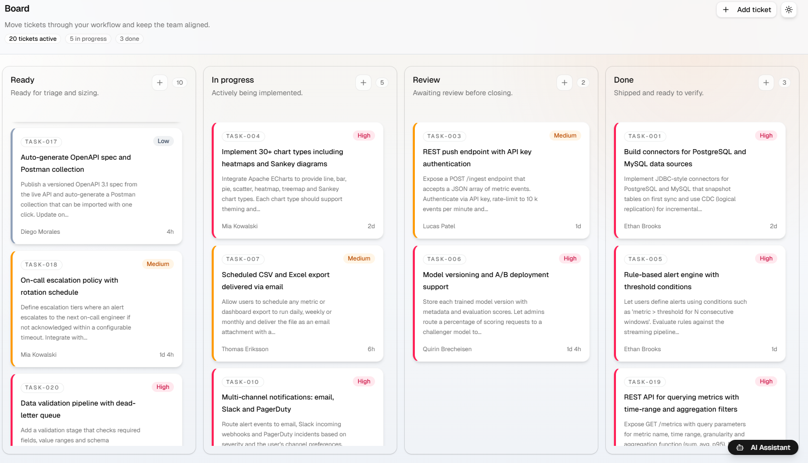
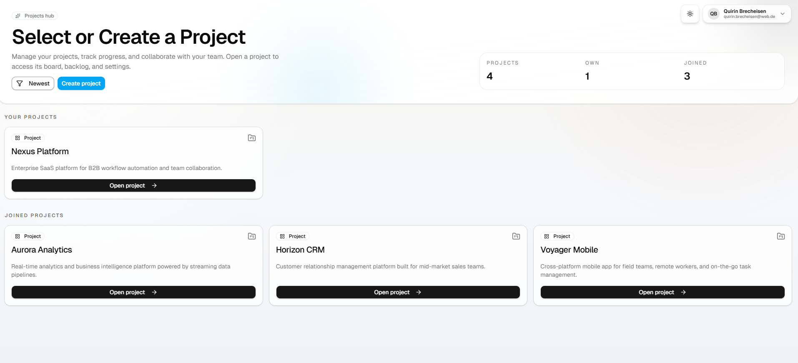
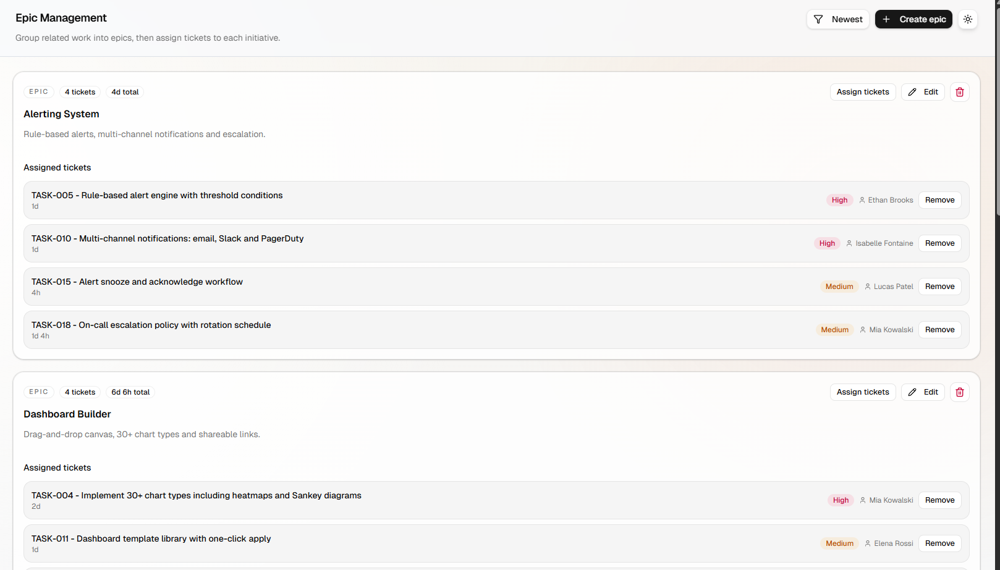

# Mini Jira

A lightweight, Jira-inspired task management web app: manage projects, track
tasks on a Kanban board, organize work into epics, collaborate via comments, and
get help from a built-in AI assistant.

Built as a university Web Services project with a .NET Aspire-orchestrated
backend and a React frontend.

---

## Tech Stack

**Backend** — ASP.NET Core ([.NET 10](https://dotnet.microsoft.com/))
* Minimal API endpoints with **API versioning** (`Asp.Versioning`)
* **CQRS via MediatR** — commands & queries in vertical feature slices
* **EF Core 10** (code-first) on **PostgreSQL** (`Npgsql`)
* **JWT** bearer authentication
* **OpenAPI** docs via Scalar / Swagger
* **Redis** output caching, **OpenTelemetry** instrumentation

**Frontend** — [React 19](https://react.dev/) + TypeScript + [Vite](https://vite.dev/)
* **Tailwind CSS 4** with **shadcn/ui** + Radix primitives
* **TanStack Query** (server state) and **Jotai** (client state)
* **React Router 7**, **dnd-kit** (drag & drop board), **Zod** validation

**Orchestration & Infrastructure**
* **.NET Aspire** AppHost wires up the server, the Vite frontend, and a Redis cache
* **PostgreSQL** runs in Docker via `docker-compose`
* **AI assistant** backed by a local [LM Studio](https://lmstudio.ai/) model (OpenAI-compatible API)

---

## Features

* **Task management** — create, edit, delete tasks; set status, priority, and time estimates
* **Kanban board** — drag tasks across status columns
* **Epics** — group related tasks under epics
* **Projects** — project ownership and membership, per-project task views
* **Comments** — collaborate on individual tasks
* **Authentication & roles** — sign up / login with JWT; Admin vs. regular users, role-based access
* **AI assistant** — ask in-app questions about your projects, tasks, and epics, or get general help (see [`docs/arc.md`](docs/arc.md#chatbot--ai-assistant))

---

## Architecture

The backend follows Onion Architecture with Repository Pattern, CQRS, MediatR,
and Vertical Slices. See **[`docs/arc.md`](docs/arc.md)** for the full write-up
including diagrams and the AI assistant design.

---

## Screenshots

| Dashboard | Board |
| --- | --- |
|  |  |

| Project page | Epic management |
| --- | --- |
|  |  |

---

## Getting Started

### Prerequisites

* [.NET 10 SDK](https://dotnet.microsoft.com/download)
* [Node.js](https://nodejs.org/) (LTS) — for the Vite frontend
* [Docker](https://www.docker.com/) — for the PostgreSQL database
* *(optional)* [LM Studio](https://lmstudio.ai/) with the local server enabled — for the AI assistant

### 1. Start the database

Create a `.env` file next to `src/MiniJiraAspire.Server/docker-compose.yml`
(this file is git-ignored):

```
POSTGRES_USER=<user>
POSTGRES_PASSWORD=<password>
POSTGRES_DB=<db-name>
ConnectionStrings__DefaultConnection=Host=localhost;Port=<port>;Database=<db-name>;Username=<user>;Password=<password>
```

Then start Postgres:

```bash
cd src/MiniJiraAspire.Server
docker compose up -d
```

Migrations are applied (and seed data inserted) automatically on server startup.
See [`src/MiniJiraAspire.Server/README.md`](src/MiniJiraAspire.Server/README.md)
for manual EF Core migration commands.

### 2. Run the app (via .NET Aspire)

From the repository root:

```bash
dotnet run --project src/MiniJiraAspire.AppHost
```

The Aspire AppHost starts the backend, the React frontend, and the Redis cache,
and exposes the **Aspire dashboard** with links to every service.

---

## Project Structure

```text
docs/                        Architecture docs & use-case PDF
src/
  MiniJiraAspire.AppHost/    .NET Aspire orchestration
  MiniJiraAspire.Server/     ASP.NET Core backend (API, MediatR, EF Core, Chatbot)
  MiniJira.Test/             Unit tests
  MiniJira.IntegrationTests/ Integration tests
  frontend/                  React + Vite frontend
```

---

## Documentation & Presentation

* **Architecture:** [`docs/arc.md`](docs/arc.md)
* **Use cases:** [`docs/Mini_Jira_UseCases_EN.pdf`](docs/Mini_Jira_UseCases_EN.pdf)
* **Presentation (Google Slides):** _https://docs.google.com/presentation/d/17-K0ufjfCULsIcsmB2qXo_lFSg7qK2RFB5pVyEQm0Lk/edit?usp=sharing_


